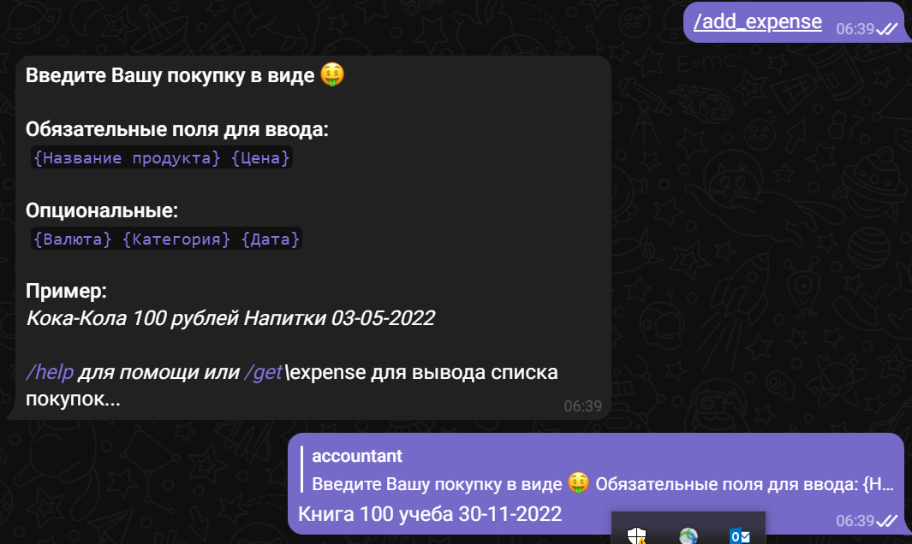
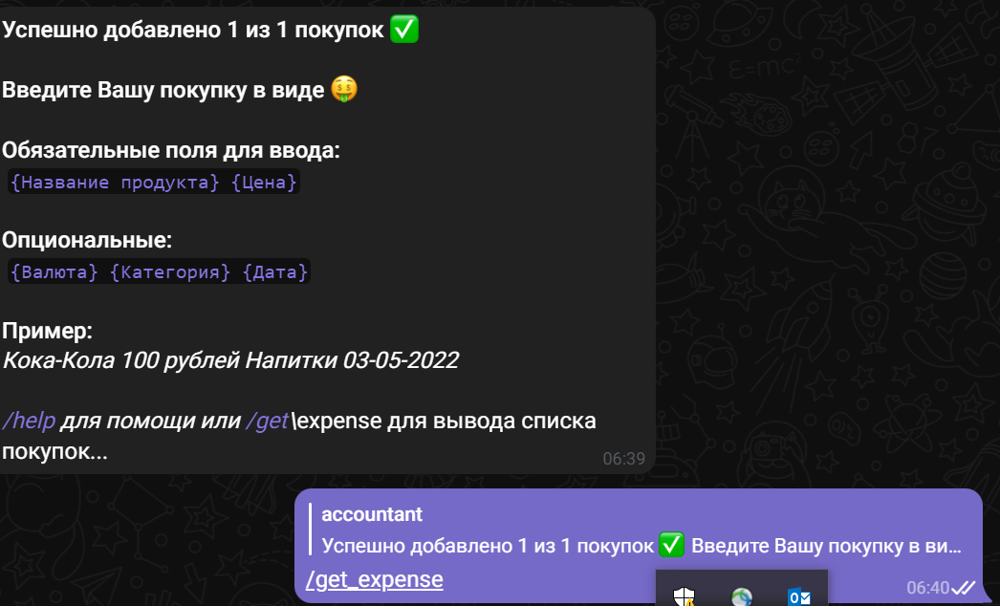
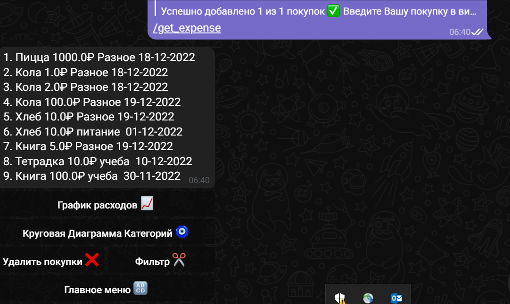
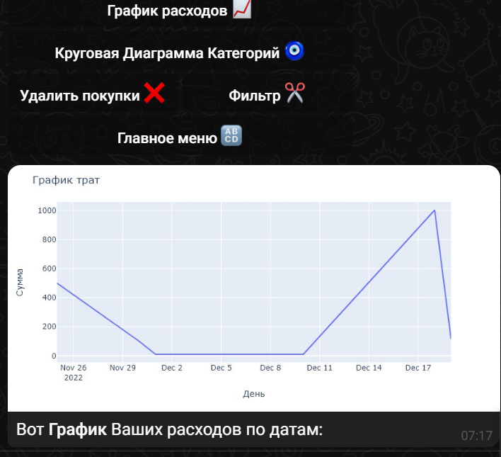
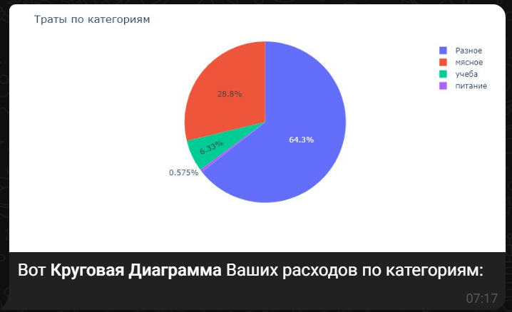

# ACCOUNTANT BOT

*Что умеет бот*
1. Приветствие
2. Добавлять покупки клиента
3. Добавить цель
4. Вести прогресс цели
5. Фильтрация по покупкам (день, месяц, все время)
6. Графики

## Пример работы бота
### Стартовое сообщение бота

### Добавление покупок

### Информация по покупкам

### Графики

