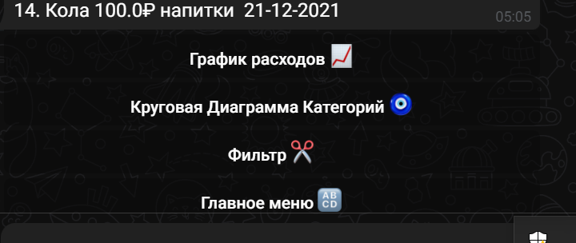

# ACCOUNTANT BOT

*ИСПРАВЛЕНИЯ*
1. Добавить парсер дат +0.2 балла

2. Переход к целям сделать удобнее - +0.3 балла

3. Поправить графики, чтобы выводились 5-10 категорий самых больших и остальное как Другое - 1 балл
Добавил код, который выводит топ 3 категории
Картинка до

Картинка после

*Что умеет бот*
1. Приветствие
2. Добавлять покупки клиента
3. Добавить цель
4. Вести прогресс цели
5. Фильтрация по покупкам (день, месяц, все время)
6. Графики

## Пример работы бота
### Стартовое сообщение бота

### Добавление покупок

### Информация по покупкам

### Графики

